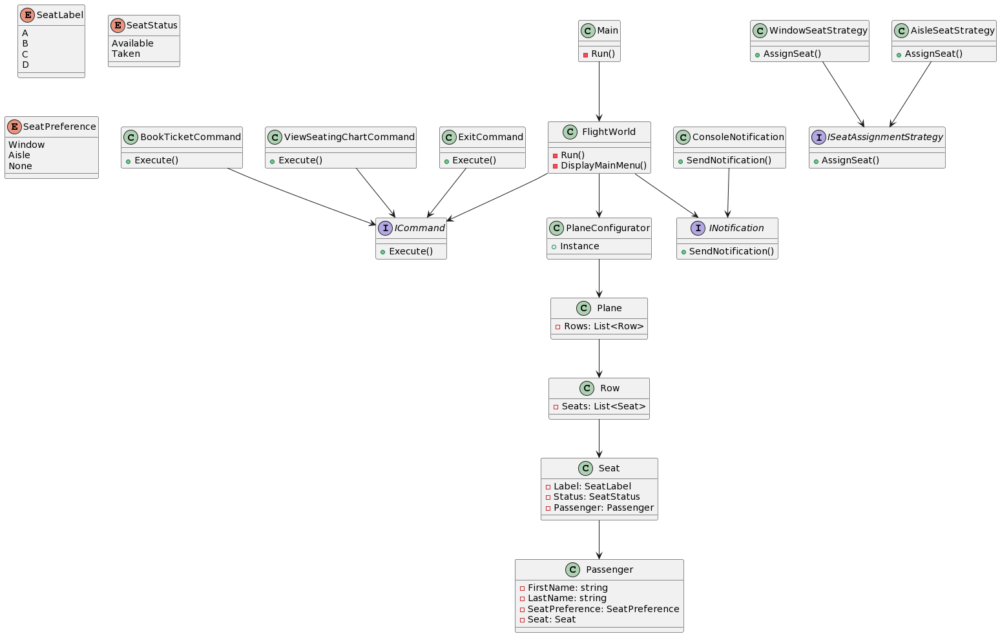

# Airline Booking System

## Description
The Airline Booking System is a console application designed to facilitate ticket booking for passengers and provide a seating chart of the plane. It allows passengers to book tickets based on their seating preferences and displays the current seating arrangement.

## Features
- **Plane Configuration**: The application simulates a plane with 12 rows, each containing seats labeled A, B, C, and D.
- **Ticket Booking**: Passengers can book tickets by providing their first name, last name, and seating preference (window, aisle, or no preference).
- **Seating Chart**: The application displays the current seating chart, showing the availability of seats and passengers' initials for occupied seats.
- **Validation**: User input for first name, last name, and seating preference is validated to ensure correctness.

## Design Patterns

### Strategy Pattern
- **Principle**: The Strategy pattern defines a family of algorithms, encapsulates each one, and makes them interchangeable. It allows the algorithm to vary independently from clients that use it.
- **Implementation**: In the Airline Booking System, the Strategy pattern is used to implement different strategies for seat assignment based on passenger preferences (window, aisle, or no preference). Each strategy is encapsulated in its own class (`WindowSeatStrategy`, `AisleSeatStrategy`, and `NoPreferenceSeatStrategy`), allowing the seat assignment algorithm to vary dynamically.

### Factory Pattern
- **Principle**: The Factory pattern provides an interface for creating objects in a superclass but allows subclasses to alter the type of objects that will be created. It promotes loose coupling by abstracting the process of object creation.
- **Implementation**: In the Airline Booking System, the Factory pattern is used to create instances of seat assignment strategies based on passenger preferences. The `SeatAssignmentStrategyFactory` class abstracts the process of strategy creation, allowing the application to create strategy objects dynamically without specifying their concrete classes.

### Command Pattern
- **Principle**: The Command pattern encapsulates a request as an object, thereby allowing parameterization of clients with queues, requests, and operations. It promotes decoupling between sender and receiver of a request.
- **Implementation**: In the Airline Booking System, the Command pattern is used to represent different actions (commands) that the application can execute, such as booking a ticket or viewing the seating chart. Each command is encapsulated in its own class (`BookTicketCommand`, `ViewSeatingChartCommand`, and `ExitCommand`).

### Singleton Pattern
- **Principle**: The Singleton pattern ensures that a class has only one instance and provides a global point of access to that instance. It is useful when exactly one object is needed to coordinate actions across the system.
- **Implementation**: In the Airline Booking System, the Singleton pattern is used to ensure that there is only one instance of the `PlaneConfigurator` class, which is responsible for configuring the plane. This ensures that all parts of the application share the same instance of the configured plane, preventing inconsistencies and duplication of state.

### Notification Pattern
- **Principle**: The Notification pattern abstracts the way objects communicate with each other, allowing them to be loosely coupled. It separates concerns by providing a mechanism for sending notifications without directly depending on the recipient.
- **Implementation**: In the Airline Booking System, the Notification pattern is used to send messages to the user via the console. The `INotification` interface defines the contract for sending notifications, while the `ConsoleNotification` class implements this interface to send notifications to the console.

## Requirements
- .NET 8.0 or later

## Usage
1. Clone the repository to your local machine.
2. Navigate to the project directory in the terminal.
3. Run the application using the following command:
dotnet run
4. Follow the on-screen instructions to book tickets or view the seating chart.
5. Enjoy using the Airline Booking System!

## Author
Allan Mangune

## License
This project is licensed under the GNU General Public License v3.0 - see the [LICENSE](LICENSE) file for details.
